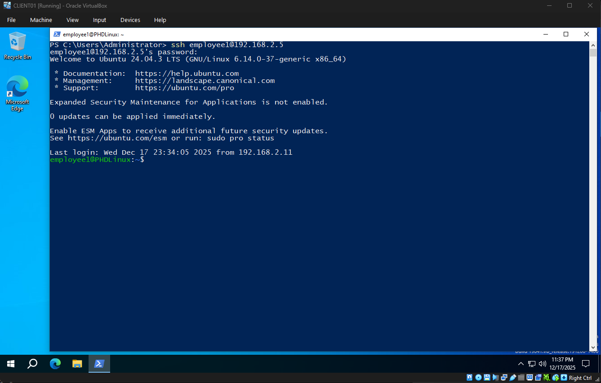
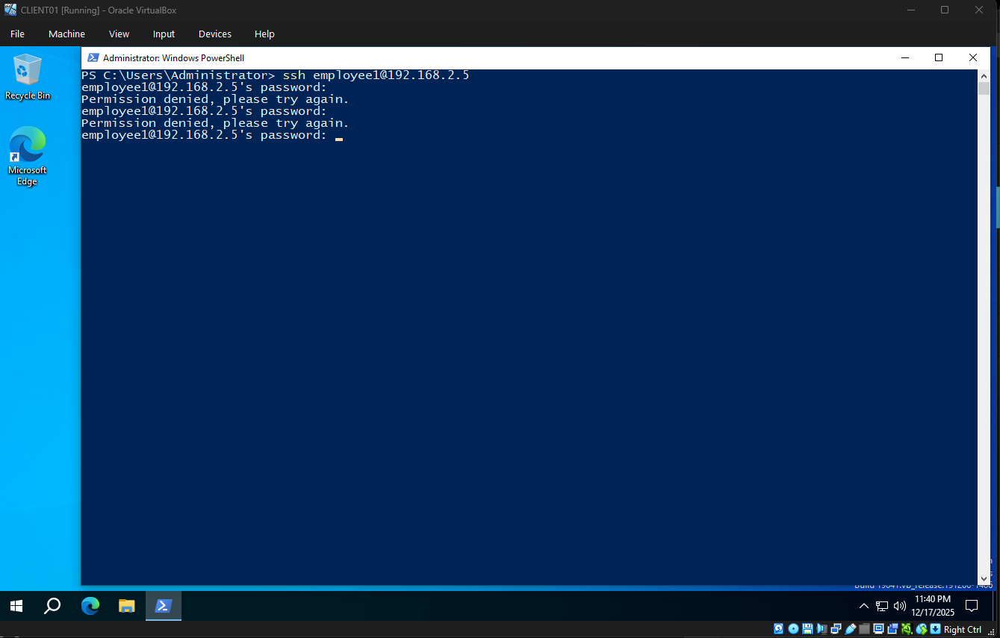
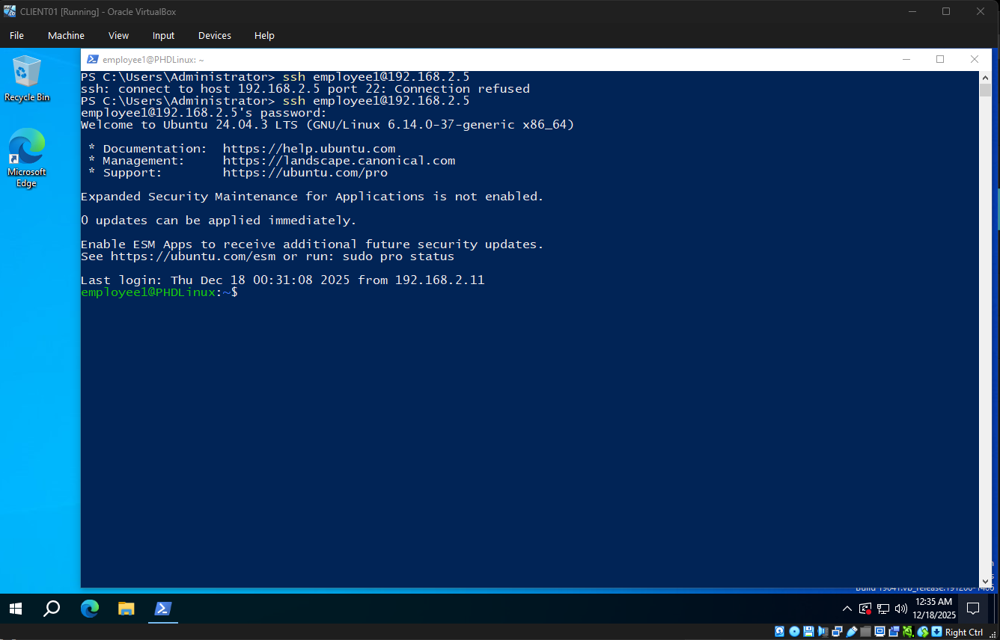
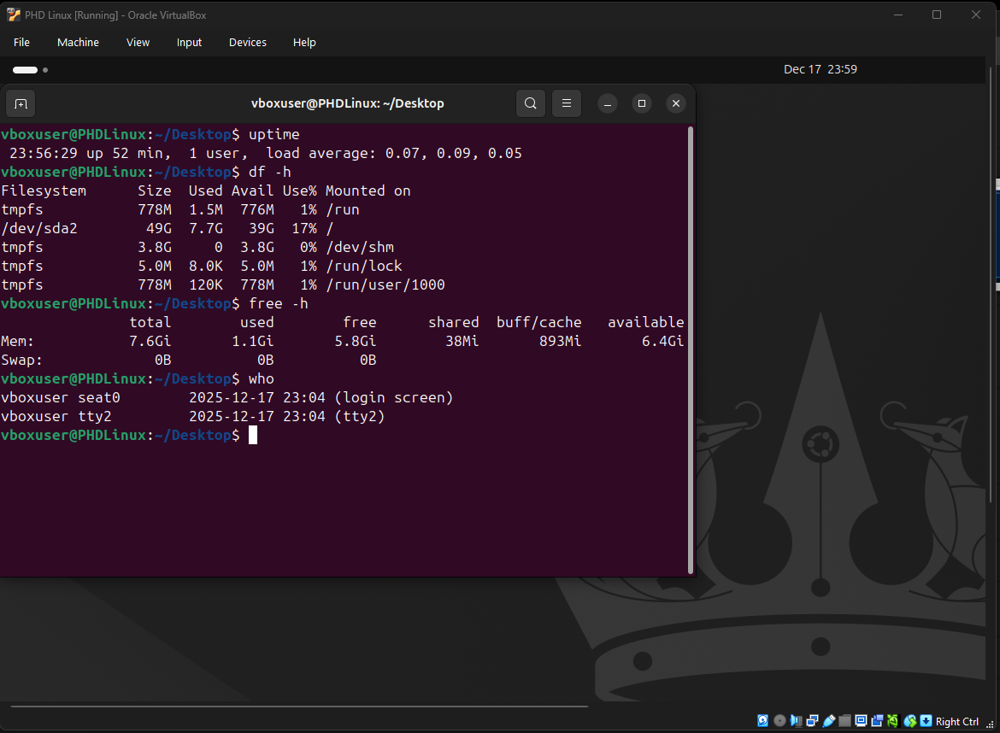
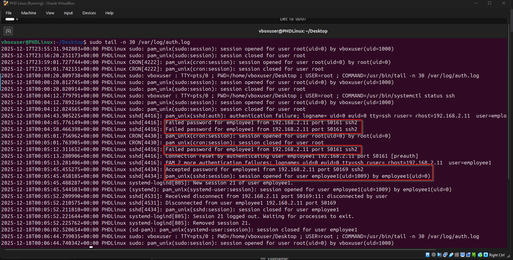
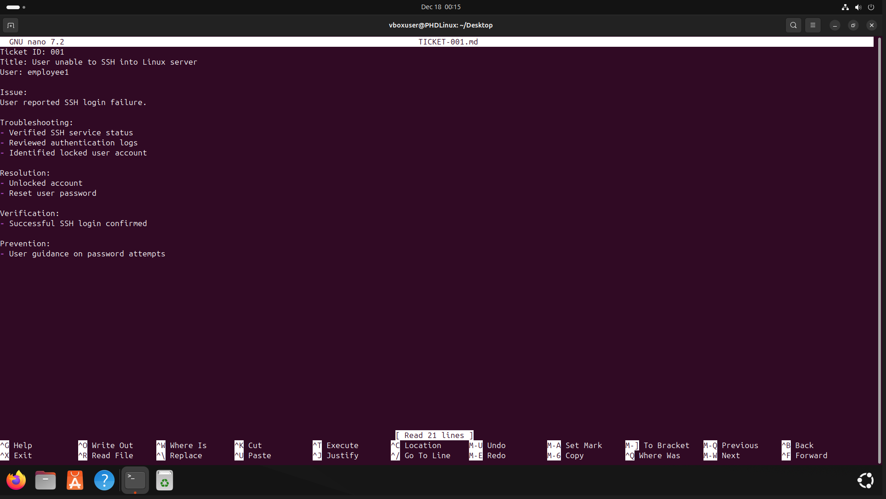

# SSH Help Desk Portfolio Project
## Remote Server Access & Troubleshooting Using SSH

---

## 📌 Project Overview
This project demonstrates basic **IT Help Desk skills** by using **SSH (Secure Shell)** to remotely access and troubleshoot a Linux server.  
The goal is to simulate real-world Help Desk scenarios such as user login issues, service outages, and basic system checks.

This lab was built for **entry-level IT Help Desk roles**.

---

## 🧑‍💻 Environment
- **Host OS:** Windows 10/11
- **Virtualization:** VirtualBox
- **Server OS:** Ubuntu Server
- **Remote Access Tool:** OpenSSH (SSH client on Windows)
- **User Accounts:**  
  - Admin user: `szilard`  
  - Standard user: `employee1`

---

## 🎯 Skills Demonstrated
- Remote server access using SSH
- User account management on Linux
- Troubleshooting SSH login issues
- Service management (`systemctl`)
- Basic system health checks
- Log review for authentication issues
- Incident documentation (ticket-style)

---

## 🛠️ Tasks Performed

### 1️⃣ SSH Server Setup
- Installed and enabled OpenSSH on Ubuntu Server
- Verified SSH service status
- Connected to the server remotely from Windows using PowerShell

---

### 2️⃣ User Access Support
- Created a standard user account to simulate an employee
- Tested successful SSH login
- Simulated a locked account scenario
- Resolved login failure by unlocking the account and resetting the password

---

### 3️⃣ SSH Troubleshooting
- Simulated SSH service downtime
- Diagnosed connection failure
- Restarted SSH service and verified functionality

---

### 4️⃣ Basic System Checks
Performed common Help Desk checks via SSH:
- System uptime and load
- Disk usage
- Memory usage
- Active user sessions
- Login history

---

### 5️⃣ Log Review
- Reviewed authentication logs (`/var/log/auth.log`)
- Identified successful and failed SSH login attempts

---

### 6️⃣ Incident Documentation
- Created a Help Desk ticket documenting:
  - User issue
  - Troubleshooting steps
  - Resolution
  - Verification
  - Prevention steps

---

## 📁 Project Structure
```text
SSH-HelpDesk-Portfolio/
├── README.md
├── TICKET-001.md
└── screenshots/
```

---

## 🧠 What I Learned
- How Help Desk technicians use SSH for remote support
- How to troubleshoot common Linux login issues
- How to safely manage user accounts
- How to verify and restart critical services
- The importance of clear documentation in IT support

---

## 🚀 Why This Project Matters
This project reflects real-world **IT Help Desk responsibilities**, including:
- Supporting users remotely
- Diagnosing access problems
- Applying basic security awareness
- Communicating solutions clearly

---

## 📎 Screenshots

### SSH Connection


### Failed Login 


### Service downtime and recovery


### System Checks and Logs 


### Authentication Logs


### Ticket Documentation


---

## 🔐 Security Note
All actions were performed in a controlled lab environment for learning and portfolio purposes.

